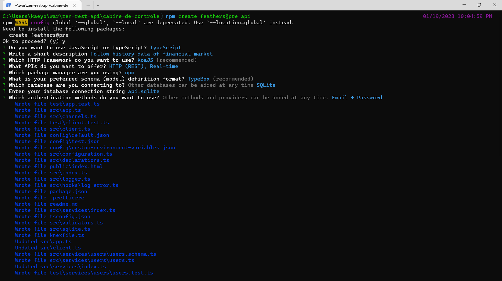
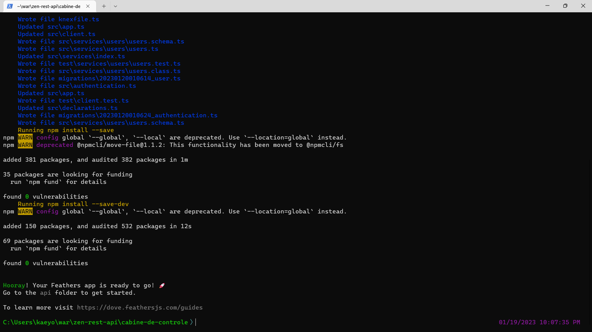
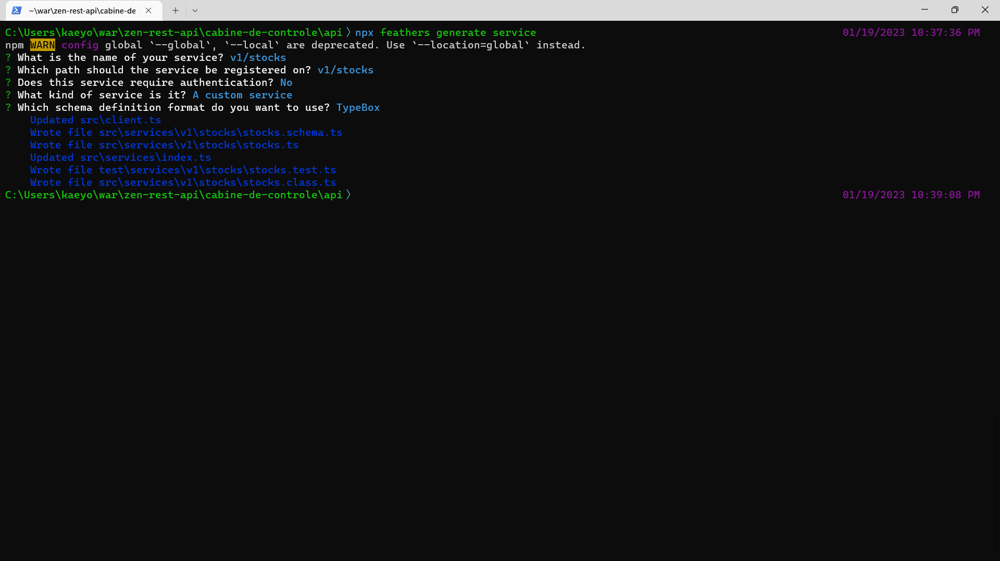
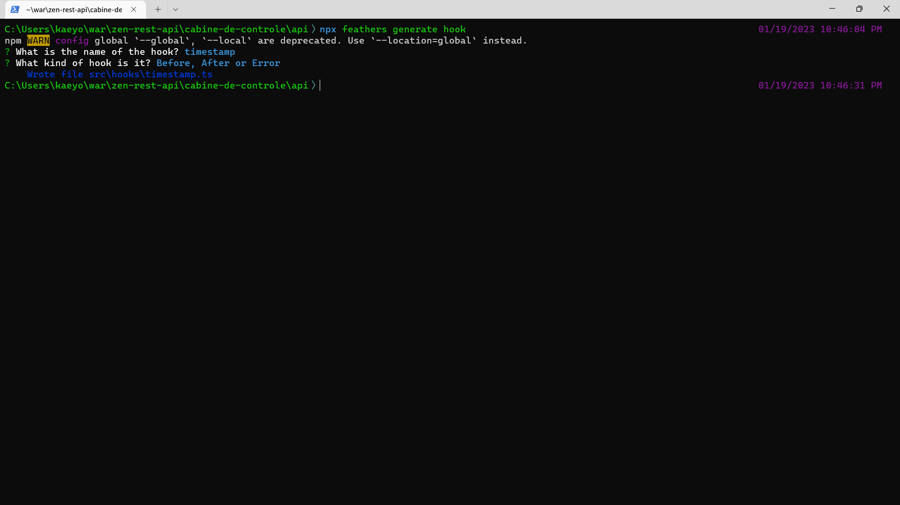
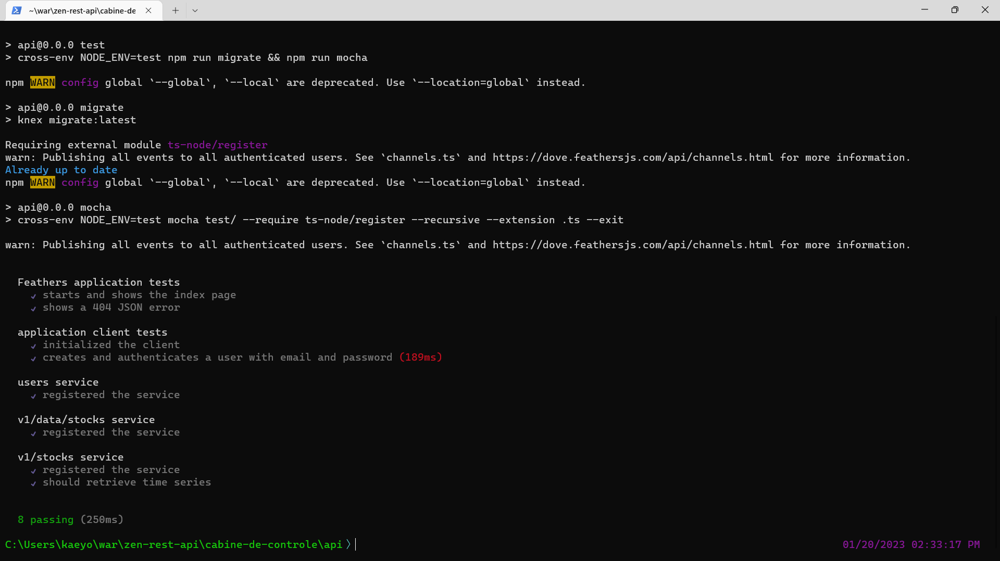

# Zen Rest API


## Sobre

Escreva projetos escalaveis em semanas. Cobrindo aspectos
importantes, de negócio, arquitetura e qualidade.

### Iniciativa

Caso você queira se aprofundar mais um pouco na linguagem Typescript,
aqui neste livro de bolso [Typescript Livro de Bolso](https://github.com/ktfth/typescript-livro-de-bolso)
eu demonstro algumas práticas que podem ajudar a desenvolver
programas de forma simplificada e objetiva.

## Motivação

Quanto maior for o seu projeto, maior a necessidade de se
ter um pedaço de software totalmente portavel e expansivo.
Então nesta série você vai aprender tecnicas avançadas para se
entregar um projeto completo.

## O que você vai aprender?

* Criação de uma API
* Criação de um serviço
* Interceptar chamadas
  * Timestamp (Impressão de tempo)
  * Consumo de um serviço
* Persistir
  * Criação de um novo serviço persistente
  * Integração com o serviço customizavel
* Testar
* Publicar
  * Criação de um Dockerfile
  * Utilização do fly.io
* Conclusão

## Apresentação

Olá eu sou o Kaique, tenho em média 17 anos de experiência
com desenvolvimento e 28 anos de idade no periodo atual em que escrevo,
minhas intenções com um trabalho como este é oferecer conteúdo o suficiente
para que o leitor possa tirar proveito de habilidades valiosas para o mercado.

## Introdução

Neste projeto nós vamos utilizar a ferramenta chamada `feathers` que
esta chegando a sua versão 5 e conta com a presença da linguagem `Typescript`
que é bastante utilizada hoje em dia, no mercado, para você reduzir erros
comuns de digitação e poder contar com fontes principais de verdade.

## Criação de uma API

Para começar o projeto você deve criar um diretório para o projeto:

```bash
mkdir cabine-de-controle
cd cabine-de-controle
```

Normalmente esta sequência de comandos faz com que o diretório
seja criado e você consiga acessa-lo de forma objetiva.

Depois de criar o lugar onde o seu projeto vai morar, você pode
dar inicio a criação do dele:

```bash
npm create feathers@pre api
```

Uma sequência de perguntas serão feitas para que você tenha o seu projeto definido:





Por fim este sera o resultado do processo de criação.
Depois acesse o projeto:

```bash
cd api/
```

E com isso você pode continuar para os próximos passos.

## Criação de um serviço

Nosso primeiro serviço que é um modo abstrado de
tratar a forma com que a lógica do consumo se aplica aqui,
pode ser criado da seguinte forma:

```bash
npx feathers generate service
```

Então você obtera a seguinte tela:



Faça as mesmas escolhas e o teu serviço estara criado.
Algo importante que não podemos esquecer de mencionar,
que agora você pode visualizar a sua aplicação:

```bash
npm run dev
```

Isto servira a sua aplicação que pode ser acessada através do endereço:

```
http://localhost:3030/v1/stocks
```

O resultado sera o seguinte:

```json
[]
```

Não temos nada ainda nesta aplicação. Mas ela esta funcionando perfeitamente se você esta vendo um "array" vazio.

## Inteceptar chamadas

Aqui você poder criar um interceptador para diferentes ações, uma para que consuma o conteúdo e outra para adicionar o propósito que imaginar, o nosso é só adicionar
um campo para registrar a data em que foi feita a requisição.

```bash
npx feathers generate hook
```

Isto resulta no seguinte ponto:



Com isto o seu hook foi criado e o conteúdo dele devera ser o seguinte após você fazer a seguinte edição:

```
context.data.timestamp = new Date().getTime()
```

Adicionando esta linha no interceptador você tera um valor
numerico com o dado esperado.

Depois basta adicionar no arquivo `stock.ts` no espaço chamado `before` que esta relacioando a execução antes mesmo de passarmos pelo código que esta presente na classe, mais precisamente em `create`.

Nós fizemos isso apenas para conhecer melhor o projeto e termos algo sendo executado. Mas talvez ele seja útil no futuro para você.

### Consumo de uma API (Avançado)

A partir deste momento nós adicionaremos um módulo que ajudara a consumir uma API externa de forma organizada e expansivel.

```bash
npm i --save ts-retrofit
```

Depois da instalação basta você criar um cliente para o serviço que deseja consumir e o resultado deve ser o seguinte:

```js
import { GET, BaseService, Response, QueryMap } from 'ts-retrofit'

interface Stock {
  meta: object;
  values: object[];
  status: string;
}

interface Stocks {
  [key: string]: Stock;
}

interface TimeSeriesQuery {
  symbol: string;
  interval: string;
  apikey: string;
}

export class StocksService extends BaseService {
  @GET('time_series')
  async getTimeSeries(@QueryMap query: TimeSeriesQuery): Promise<Response<Stocks>> {
    return <Response<Stocks>> {}
  }
}
```

A coisa mais importante aqui é ter uma ideia de onde cada peça vai, para que entenda o funcionamento total, que esta presente neste repositório.

Agora nós teremos que criar o serviço de armazenamento de dados e fazer as devidas inclusões:

```bash
npx feathers generate service
```

Seguindo o mesmo padrão só que agora utilizando o nome `v1/data/stocks` e com isso você tera como persistir as informações que podem ser verificadas no repositório final para ter um endendimento melhor.

## Como testar?

Após a implentação a ordem não importa muito se você esta condicionando o desenvolvimento da melhor forma possível dentro do seu contexto de atuação, então você devera instalar:

```bash
npm i --save-dev nock
```

E o resultado do código devera ser este:

```js
// For more information about this file see https://dove.feathersjs.com/guides/cli/service.test.html
import assert from 'assert'
import { app } from '../../../../src/app'
import nock from 'nock'

describe('v1/stocks service', () => {
  it('registered the service', () => {
    const service = app.service('v1/stocks')

    assert.ok(service, 'Registered the service')
  })

  it('should retrieve time series', async () => {
    const service = app.service('v1/stocks')

    const financialData = app.get('financialData')

    const scope = nock(financialData.url)
      .get(`/time_series?symbol=ETH/BTC&interval=1min&apikey=${financialData.apiKey}`)
      .reply(200, {
        "meta": {
          "symbol": "ETH/BTC",
          "interval": "1min",
          "currency_base": "Ethereum",
          "currency_quote": "Bitcoin",
          "exchange": "Huobi",
          "type": "Digital Currency"
        },
        "values": [
          {
            "datetime": "2023-01-20 17:26:00",
            "open": "0.07444",
            "high": "0.07444",
            "low": "0.07444",
            "close": "0.07444"
          },
          {
            "datetime": "2023-01-20 17:25:00",
            "open": "0.07444",
            "high": "0.07444",
            "low": "0.07444",
            "close": "0.07444"
          },
          {
            "datetime": "2023-01-20 17:24:00",
            "open": "0.07444",
            "high": "0.07444",
            "low": "0.07444",
            "close": "0.07444"
          },
          {
            "datetime": "2023-01-20 17:23:00",
            "open": "0.07436",
            "high": "0.07436",
            "low": "0.07436",
            "close": "0.07436"
          },
          {
            "datetime": "2023-01-20 17:22:00",
            "open": "0.07436",
            "high": "0.07436",
            "low": "0.07436",
            "close": "0.07436"
          },
          {
            "datetime": "2023-01-20 17:21:00",
            "open": "0.07436",
            "high": "0.07436",
            "low": "0.07436",
            "close": "0.07436"
          },
          {
            "datetime": "2023-01-20 17:20:00",
            "open": "0.07436",
            "high": "0.07436",
            "low": "0.07436",
            "close": "0.07436"
          },
          {
            "datetime": "2023-01-20 17:19:00",
            "open": "0.07436",
            "high": "0.07436",
            "low": "0.07436",
            "close": "0.07436"
          },
          {
            "datetime": "2023-01-20 17:18:00",
            "open": "0.07436",
            "high": "0.07436",
            "low": "0.07436",
            "close": "0.07436"
          },
          {
            "datetime": "2023-01-20 17:17:00",
            "open": "0.07436",
            "high": "0.07436",
            "low": "0.07436",
            "close": "0.07436"
          },
          {
            "datetime": "2023-01-20 17:16:00",
            "open": "0.07436",
            "high": "0.07436",
            "low": "0.07436",
            "close": "0.07436"
          },
          {
            "datetime": "2023-01-20 17:15:00",
            "open": "0.07436",
            "high": "0.07436",
            "low": "0.07436",
            "close": "0.07436"
          },
          {
            "datetime": "2023-01-20 17:14:00",
            "open": "0.07435",
            "high": "0.07436",
            "low": "0.07435",
            "close": "0.07436"
          },
          {
            "datetime": "2023-01-20 17:13:00",
            "open": "0.07435",
            "high": "0.07435",
            "low": "0.07435",
            "close": "0.07435"
          },
          {
            "datetime": "2023-01-20 17:12:00",
            "open": "0.07435",
            "high": "0.07435",
            "low": "0.07435",
            "close": "0.07435"
          },
          {
            "datetime": "2023-01-20 17:11:00",
            "open": "0.07426",
            "high": "0.07435",
            "low": "0.07426",
            "close": "0.07435"
          },
          {
            "datetime": "2023-01-20 17:10:00",
            "open": "0.07426",
            "high": "0.07426",
            "low": "0.07426",
            "close": "0.07426"
          },
          {
            "datetime": "2023-01-20 17:09:00",
            "open": "0.07426",
            "high": "0.07426",
            "low": "0.07426",
            "close": "0.07426"
          },
          {
            "datetime": "2023-01-20 17:08:00",
            "open": "0.07438",
            "high": "0.07438",
            "low": "0.07427",
            "close": "0.07427"
          },
          {
            "datetime": "2023-01-20 17:07:00",
            "open": "0.07438",
            "high": "0.07438",
            "low": "0.07438",
            "close": "0.07438"
          },
          {
            "datetime": "2023-01-20 17:06:00",
            "open": "0.07438",
            "high": "0.07438",
            "low": "0.07438",
            "close": "0.07438"
          },
          {
            "datetime": "2023-01-20 17:05:00",
            "open": "0.07438",
            "high": "0.07438",
            "low": "0.07438",
            "close": "0.07438"
          },
          {
            "datetime": "2023-01-20 17:04:00",
            "open": "0.07439",
            "high": "0.07439",
            "low": "0.07439",
            "close": "0.07439"
          },
          {
            "datetime": "2023-01-20 17:03:00",
            "open": "0.07439",
            "high": "0.07439",
            "low": "0.07439",
            "close": "0.07439"
          },
          {
            "datetime": "2023-01-20 17:02:00",
            "open": "0.07440",
            "high": "0.07440",
            "low": "0.07440",
            "close": "0.07440"
          },
          {
            "datetime": "2023-01-20 17:01:00",
            "open": "0.07443",
            "high": "0.07443",
            "low": "0.07440",
            "close": "0.07440"
          },
          {
            "datetime": "2023-01-20 17:00:00",
            "open": "0.07436",
            "high": "0.07443",
            "low": "0.07436",
            "close": "0.07443"
          },
          {
            "datetime": "2023-01-20 16:59:00",
            "open": "0.07436",
            "high": "0.07436",
            "low": "0.07436",
            "close": "0.07436"
          },
          {
            "datetime": "2023-01-20 16:58:00",
            "open": "0.07436",
            "high": "0.07436",
            "low": "0.07436",
            "close": "0.07436"
          },
          {
            "datetime": "2023-01-20 16:57:00",
            "open": "0.07436",
            "high": "0.07436",
            "low": "0.07436",
            "close": "0.07436"
          }
        ],
        "status": "ok"
      })

    const result = await service.find({
      query: {
        symbol: 'ETH/BTC',
      }
    })
    
    assert.ok(result)
  })
})
```

E esta pronto, basta rodar o comando para ver a saida dele como `sucesso` se este for o caso:



Este é um projeto singelo com o objetivo de explorar boas possibilidades para que você desenvolva projetos simples, e com qualidade.

## Publicação (BÔNUS)

Ao final do processo nós deveremos fazer com que nossa aplicação chegue a possa consumir o projeto final, neste passo nós utilizaremos o [fly.io](https://fly.io) uma ferramenta que facilita a homologação do projeto bastante conhecida como `deploy`.

Depois de instalado a ferramenta de publicação do `fly.io` você pode seguir da seguinte maneira:

* Configuração

```yml
[build]
  builder = "heroku/buildpacks:20"
```

* Deploy

```bash
npm run compile && fly deploy
```

* Resultado

Você pode acessar a aplicação com através da url devolvida pelo app.

``

## Conclusão

Então para resumirmos tudo o que fizemos, a ideia foi criar uma aplicação simples que recupera os valores de um recursos, depois testamos e publicamos.

Espero que tenha gostado e que possa compartilhar o resultado para chegarmos ao máximo de pessoas possível.

[DEMO](https://cabine-de-controle-api.fly.dev/)

Divirta-se!